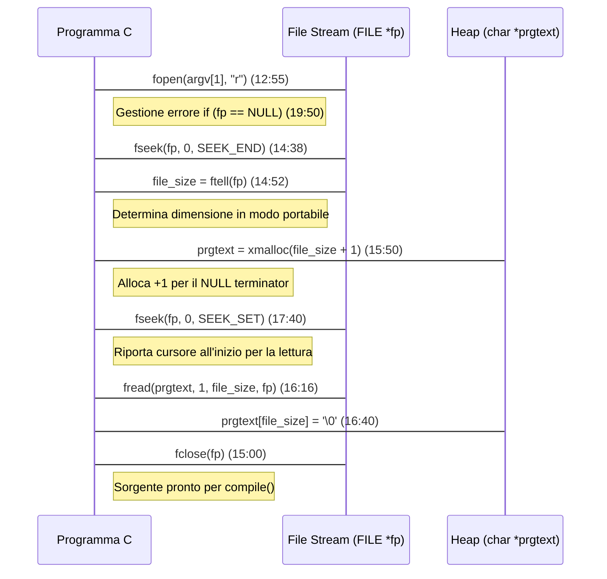

## 🧭 Indice degli Argomenti e Timeline

  - [1. Strutture Dati Centrali e Contesto di Esecuzione](#1-strutture-dati-centrali-e-contesto-di-esecuzione) (0:00 - 1:47)
      - [1.1. L'Oggetto Polimorfico (`tfobj`)](#11-loggetto-polimorfico-tfobj) (0:06)
      - [1.2. La Struttura di Stato del Parser (`TFParser`)](#12-la-struttura-di-stato-del-parser-tfparser) (1:47)
  - [2. Ottimizzazione delle Strutture Lista/Stack in C](#2-ottimizzazione-delle-strutture-listastack-in-c) (3:51 - 9:30)
      - [2.1. Array Dinamico vs. Linked List: Criteri di Design](#21-array-dinamico-vs-linked-list-criteri-di-design) (4:13)
      - [2.2. Complessità Ammortizzata O(1) e Cache Locality](#22-complessità-ammortizzata-o1-e-cache-locality) (7:10)
      - [2.3. Implementazione di `listPush` e Gestione `realloc`](#23-implementazione-di-listpush-e-gestione-realloc) (26:05)
  - [3. Gestione I/O: Caricamento Portabile del Sorgente](#3-gestione-io-caricamento-portabile-del-sorgente) (12:48 - 19:40)
      - [3.1. Flusso di Dati per la Lettura del File (Sequence Diagram)](#31-flusso-di-dati-per-la-lettura-del-file-sequence-diagram)
      - [3.2. Codice per Determinare Dimensione e Lettura](#32-codice-per-determinare-dimensione-e-lettura)
  - [4. Il Processo di Parsing Manuale (`compile`)](#4-il-processo-di-parsing-manuale-compile) (24:12 - 37:25)
      - [4.1. Logica Concettuale della Compilazione (Workflow)](#41-logica-concettuale-della-compilazione-workflow)
      - [4.2. Funzione `parseSpaces`](#42-funzione-parsespaces) (26:00)
      - [4.3. Funzione `parseNumber`](#43-funzione-parsenumber) (33:55)
  - [5. Linguaggi Stack-Based e Variable Capturing](#5-linguaggi-stack-based-e-variable-capturing) (21:00 - 24:00)

-----

## 1\. Strutture Dati Centrali e Contesto di Esecuzione (0:00 - 1:47)

### 1.1. L'Oggetto Polimorfico (`tfobj`) (0:06)

Per scrivere un interprete, è necessaria una **struttura dati universale** che rappresenti ogni elemento del linguaggio (token sintattici e stato di esecuzione come variabili e stack). Questa struttura è l'oggetto base (`tfobj`).

```c
// tfobj: Struttura universale per rappresentare elementi del linguaggio e stato.
typedef struct tfobj {
    size_t type;            // Tipo dell'oggetto (es. INT, LIST, SYMBOL)
    int ref_count;          // Conteggio delle referenze (per il GC/cleanup) (1:17)
    union {
        long i;             // Contenuto per oggetti di tipo INT (0:10)
        // ... altri tipi (boolean, symbol)
        struct {
            struct tfobj **ele; // Array dinamico di puntatori ad oggetti (per lista/stack) (4:02)
            size_t len;         // Numero corrente di elementi
            // size_t alloc_len; // Spazio allocato per ottimizzazione (7:10)
        } list;
    };
} tfobj;
```

### 1.2. La Struttura di Stato del Parser (`TFParser`) (1:47)

Il `TFParser` centralizza lo stato del parsing, rendendolo più comodo e pulito. Invece di far ritornare o passare puntatori di puntatori (`char **`) tra funzioni per tracciare il progresso, si passa solo il puntatore al parser, e la posizione corrente (`p`) avanza.

```c
// TFParser: Struttura di stato del parsing (2:06)
typedef struct tfparser {
    char *prg; // Riferimento all'inizio del programma (per riferimento) (2:10)
    char *p;   // Puntatore corrente (la "P" che avanza) (2:10)
    // int line; // Numero di linea per segnalazione errori (2:25)
} tfparser;
```

-----

## 2\. Ottimizzazione delle Strutture Lista/Stack in C (3:51 - 9:30)

La scelta cruciale di design è implementare la struttura logica **Lista/Stack** utilizzando un **Array Dinamico** (`tfobj** ele`) anziché una *Linked List* (lista concatenata).

### 2.1. Array Dinamico vs. Linked List: Criteri di Design (4:13)

| Caratteristica | Array Dinamico (Scelta del relatore) | Linked List (Alternativa Scartata) |
| :--- | :--- | :--- |
| **Complessità Inserimento** | $O(N)$ nel caso peggiore (richiede `realloc`) | **$O(1)$** (sempre costante) |
| **Accesso Casuale (i-esimo)** | **$O(1)$** (accesso diretto, enorme vantaggio) | $O(N)$ (deve attraversare i nodi) |
| **Località della Cache** | **Ottima** (dati contigui in memoria) | Cattiva (dati sparsi, overhead di puntatori) |
| **Spreco di Memoria** | Minimo | Alto (ogni nodo ha puntatori `next`/`prev`) |

L'uso di $O(N)$ per l'accesso casuale in un array dinamico non ottimizzato può portare programmi altrimenti semplici, come un ciclo `for`, ad avere una complessità quadratica ($O(N^2)$).

### 2.2. Complessità Ammortizzata O(1) e Cache Locality (7:10)

Per ottenere l'efficienza della *linked list* con i vantaggi dell'array, si implementa la **Complessità Ammortizzata** (Amortized Time Complexity):

1.  Aggiungere un campo `size_t alloc_len`.
2.  Quando la lista cresce, l'allocazione viene **raddoppiata** a potenze di due (4, 8, 16...).
3.  L'operazione costosa di `realloc` si esegue con frequenza sempre minore, portando il costo medio dell'inserimento a **$O(1)$**.

Questa tecnica fornisce la **massima località della cache**, un vantaggio "enorme e impagabile" nella programmazione di sistema.

### 2.3. Implementazione di `listPush` con `realloc` (26:05)

La funzione usa `realloc` per ridimensionare l'array di puntatori (`tfobj** ele`).

```c
// listPush: Aggiunge 'ele' alla lista 'l', ridimensionando con realloc.
void listPush(tfobj *l, tfobj *ele) {
    // Calcola la nuova dimensione
    size_t new_len = l->list.len + 1;
    
    // Rialloca l'array di puntatori. Se l->list.ele è NULL, realloc agisce come malloc. (29:40)
    tfobj **new_ele = realloc(l->list.ele, sizeof(tfobj*) * new_len);

    // [omesso: controllo di errore per realloc]

    l->list.ele = new_ele; 

    // Assegna il nuovo elemento
    l->list.ele[l->list.len] = ele;
    
    // Aggiorna la lunghezza
    l->list.len++; 

    /* NOTA SUL REFERENCE COUNTING:
    È responsabilità del chiamante (caller) gestire l'incremento di ref_count(ele) 
    dopo il push, se necessario. (30:20)
    */
}
```

-----

## 3\. Gestione I/O: Caricamento Portabile del Sorgente (12:48 - 19:40)

Il caricamento dell'intero file sorgente in un buffer di memoria è un passaggio standard che deve essere fatto in modo **portabile** (solo con la Lib C standard).

### 3.1. Flusso di Dati per la Lettura del File (Sequence Diagram)

Questo flusso garantisce di allocare esattamente la memoria necessaria.



### 3.2. Codice per Determinare Dimensione e Lettura

```c
// Estratto dalla main() (12:48)
#include <stdio.h>
#include <stdlib.h> // Per xmalloc (simulato)

// ...

FILE *fp = fopen(argv[1], "r");
if (fp == NULL) {
    perror("Opening Toy Fort program");
    return 1;
}

// 1. Determina la dimensione (14:15 - 15:00)
fseek(fp, 0, SEEK_END); 
long file_size = ftell(fp); 

// 2. Alloca il buffer (15:50)
char *prgtext = xmalloc(file_size + 1);

// 3. Riposiziona il cursore (17:40)
fseek(fp, 0, SEEK_SET); // SEEK_SET = inizio del file (17:59)

// 4. Legge l'intero contenuto e null-termina (16:16 - 16:40)
fread(prgtext, 1, file_size, fp);
prgtext[file_size] = 0; 

fclose(fp);
// ... compile(prgtext);
```

-----

## 4\. Il Processo di Compilazione Manuale (`compile`) (24:12 - 37:25)

La funzione `compile` (che in realtà è un **parser**) converte la stringa sorgente in una lista di oggetti `tfobj`.

**Logica di Sviluppo Parser:** Per linguaggi seri, il parser va scritto **a mano**, non generato, ed è fondamentale imparare a farlo.

### 4.1. Logica Concettuale della Compilazione (Workflow)

```mermaid
graph TD
    A[Inizia compile(prg) (24:12)] --> B(Inizializza TFParser);
    B --> C(tfobj *parsed = createListObject());
    C --> D{while (parser->p[0] != '\0')};
    D -- Loop --> E(parseSpaces(parser));
    E --> F{parser->p[0] == '\0'? (25:52)};
    F -- Sì --> G[Fine Parsing];
    F -- No --> H(char *token_start = parser->p);
    H --> I{isdigit(p[0]) || p[0] == '-'? (33:05)};
    I -- Sì --> J(tfobj *o = parseNumber(parser));
    I -- No --> K(Gestione altri token/simboli);
    J |o| K --> L{o == NULL? (Errore)};
    L -- Sì --> M(Segnala "syntax error near..." token_start);
    M --> N[Return NULL];
    L -- No --> O(listPush(parsed, o));
    O --> D;
    G --> P[Return parsed (Lista del programma)];
```

### 4.2. Funzione `parseSpaces` (26:00)

Utilizza `isspace()` dalla libreria `ctype.h` per saltare caratteri bianchi (spazi, tab, newline).

```c
// parseSpaces: Avanza il puntatore 'p' oltre gli spazi (26:47)
void parseSpaces(tfparser *parser) {
    #include <ctype.h>
    while (isspace((unsigned char)parser->p[0])) {
        parser->p++;
    }
}
```

### 4.3. Funzione `parseNumber` (33:55)

Funzione per estrarre un numero intero con segno (`long`) e avanzare il puntatore del parser.

```c
#define MAX_NUM_LEN 128 (37:50)

// parseNumber: Parsa un numero intero con segno (33:55)
tfobj *parseNumber(tfparser *parser) {
    char *start = parser->p;
    char buff[MAX_NUM_LEN]; 

    // 1. Gestione segno (il '-' può apparire solo all'inizio) (35:10)
    if (parser->p[0] == '-') {
        parser->p++;
    }

    // 2. Consumo cifre (35:20)
    while (isdigit((unsigned char)parser->p[0])) {
        parser->p++;
    }

    char *end = parser->p;
    int numlen = end - start; // Calcola la lunghezza per sottrazione puntatori (36:20)

    if (numlen == 0 || numlen >= MAX_NUM_LEN) return NULL; // Controllo dimensione

    // 3. Copia con memcpy e null-termination (38:35 - 39:00)
    #include <string.h> // necessario per memcpy (40:08)
    memcpy(buff, start, numlen);
    buff[numlen] = '\0';

    // 4. Conversione e creazione oggetto (si usa atol/atoi per semplicità) (39:20)
    long value = atol(buff); 
    // tfobj *o = createIntObject(value);

    // return o;
    return NULL; // Placeholder
}
```

-----

## 5\. Linguaggi Stack-Based e Variable Capturing (21:00 - 24:00)

Il relatore introduce il concetto dei linguaggi **concatenativi** (come il Forth e la variante **Joy**), che operano manipolando direttamente lo stack.

  * **Esempio base:** `5 dup * print` (Stack: `[5] -> [5, 5] -> [25] -> stampa 25`).

Il relatore propone l'uso di una sintassi basata su **Tuple** (`[a, b]`) per implementare il **Variable Capturing** (cattura di variabili locali). Questo permette di associare un valore prelevato dallo stack a un simbolo locale, migliorando la leggibilità e la maneggevolezza del linguaggio.

  * **Esempio di cattura:** `5 [a]` cattura `5` nella variabile locale `a`.
  * **Implementazione:** Questa cattura può essere gestita in una fase di **precompilazione** (simile alla compilazione in bytecode), dove i simboli locali come `$a` vengono risolti in indici fissi in una tabella di variabili locali.

-----

**Prossimo Passo:** Il relatore accenna a una funzione `exec` per stampare la lista di oggetti compilati (`5 10 20`) e verificarne il corretto parsing. Ti piacerebbe che implementassi la parte minimale della funzione `exec` per la stampa della lista parsificata?